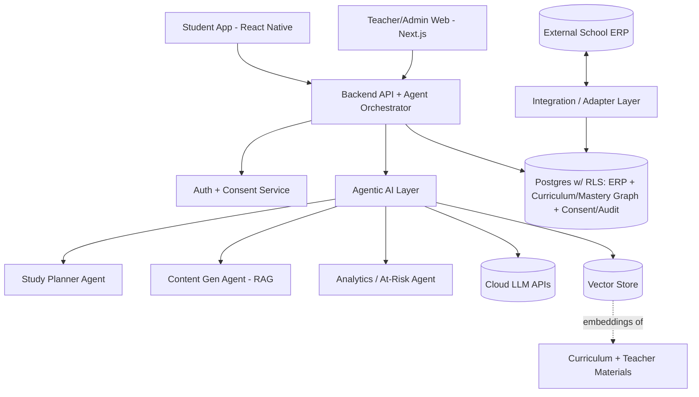

# ManthanAI — Product Requirements Document (PRD)

> **Manthan** (मंथन) — "churning to extract the essence." ManthanAI churns curriculum, study activity, and school data into learning outcomes and operational intelligence.

| Field | Value |
|---|---|
| Product | ManthanAI |
| Document type | Product Requirements Document (PRD) |
| Version | 1.0 (Draft) |
| Status | For review |
| Last updated | 2026-07-09 |
| Owner | Product (TBD) |
| Stakeholders | Founding team (3 devs), pilot schools, students, teachers, parents |
| Market | India — CBSE / ICSE / State boards (K-12) |

---

## 1. Executive Summary

ManthanAI is a **two-sided, multi-tenant SaaS platform** for K-12 schools in India that unifies student self-study and school administration on a single data backbone.

- **Student side:** An *agentic AI study companion* that plans, generates syllabus-grounded study content, tracks mastery, and actively follows up with students (mobile-first).
- **School side:** An *AI-infused ERP + analytics system* for teachers and administrators, with at-risk detection, class/individual analytics, and (in later phases) full ERP operations.
- **The moat:** Both sides read and write the **same curriculum-and-mastery graph**. A student's study data feeds school analytics; the school's syllabus and assessments ground the student's AI. For schools with an existing ERP, ManthanAI offers a **plug-and-play connector** so it becomes the "AI brain" on top of any system.

The platform is designed to be **DPDP Act 2023–compliant** from day one, treating verifiable parental consent, data isolation, and auditability as first-class architecture.

---

## 2. Problem Statement

1. **Students** study in fragmented ways — generic apps, unstructured YouTube, coaching notes — with no personalized plan tied to their actual syllabus, and no reliable tracking of what they've mastered.
2. **AI study tools** hallucinate and are not grounded in the student's specific board/grade/chapter, making teachers distrust them.
3. **Schools** run on ERPs (or spreadsheets) that capture operations but contain **zero learning intelligence** — teachers can't easily see who is falling behind until exams.
4. **The two worlds are disconnected:** self-study data never reaches the teacher, and school assessments never personalize the student's study.

**ManthanAI's thesis:** If student mastery data and the school's academic record are the *same underlying graph*, and AI agents act on that graph, both students and schools get compounding value that neither a standalone study app nor a standalone ERP can deliver.

---

## 3. Goals & Non-Goals

### 3.1 Goals (Pilot)
- Deliver three undeniably strong "wow" features: (a) AI study planner + tracking, (b) syllabus-grounded content generation, (c) teacher analytics with at-risk detection.
- Ship a **thin but real ERP** (students, classes, subjects, enrollment, assessments) that feeds the AI.
- Support **connector mode** (CSV import first) for schools with existing ERPs.
- Be **DPDP-compliant** for minors' data (verifiable parental consent, isolation, auditability).
- Instrument all three success dimensions: engagement, learning outcomes, operational value.
- Onboard 1–3 pilot schools.

### 3.2 Non-Goals (Pilot)
- Full ERP (fees, HR, admissions, transport, payroll) — deferred to Phase 2.
- API/webhook connectors to specific commercial ERPs — deferred to Phase 3 (adapter interface built now).
- Multi-language content (Hindi/regional) — architected for, not delivered in pilot.
- Self-hosted/open LLMs — pilot uses cloud LLM APIs.
- Parent-facing app — parent involvement limited to the consent flow in the pilot.
- Offline-first mobile — deferred.

---

## 4. Target Users & Personas

### Persona 1 — Aarav, the Student (age 15, CBSE Class 10)
- **Context:** Board exam year, juggles 6 subjects, uses a phone constantly.
- **Goals:** Know what to study today, get clear notes/practice, feel progress, not fall behind.
- **Pains:** Overwhelmed, doesn't know weak areas, generic apps don't match his syllabus.
- **Needs from ManthanAI:** A daily plan, grounded content, visible progress, gentle nudges.

### Persona 2 — Mrs. Nair, the Teacher (Class 10 Science)
- **Context:** Teaches 3 sections (~120 students), limited time, does manual grading and reports.
- **Goals:** Spot struggling students early, save time on content/comms, evidence for interventions.
- **Pains:** No visibility into self-study, at-risk students discovered too late, report drudgery.
- **Needs from ManthanAI:** Class + individual mastery dashboards, at-risk alerts, AI-drafted insights, ability to upload her own materials for grounding.

### Persona 3 — Mr. Rao, the School Admin / Coordinator
- **Context:** Manages enrollment, sections, academic setup; may already run an ERP.
- **Goals:** Smooth onboarding, data control, compliance, demonstrable value to management/parents.
- **Pains:** Data migration friction, privacy/compliance risk, tool sprawl.
- **Needs from ManthanAI:** Easy tenant setup, CSV/connector import, role management, compliance controls, pilot success metrics.

### Persona 4 — Mrs. Sharma, the Parent (Guardian of a minor)
- **Context:** Must consent to her child's data being processed (DPDP).
- **Goals:** Trust the platform, understand what data is used and why, control/withdraw consent.
- **Needs from ManthanAI:** Clear itemized consent notice, simple verification, ability to review/withdraw.

### Persona 5 — Super Admin (ManthanAI internal / platform operator)
- **Context:** Operates the multi-tenant platform.
- **Needs:** Tenant provisioning, monitoring, audit access, incident/breach handling.

---

## 5. User Stories

> Format: *As a `<role>`, I want `<capability>`, so that `<benefit>`.* Each story has acceptance criteria (AC). IDs are stable references.

### 5.1 Authentication, Tenancy & Roles
- **US-AUTH-1** — As a **Super Admin**, I want to provision a new school tenant, so that its data is fully isolated from other schools.
  - AC: Creating a tenant generates an isolated data scope; users of tenant A can never read tenant B data (enforced at DB via row-level security).
- **US-AUTH-2** — As a **School Admin**, I want to invite teachers and create student accounts within my school, so that the right people have the right access.
  - AC: Role-based access (student, teacher, admin, super admin); invites are scoped to the tenant; role guards enforced on every endpoint.
- **US-AUTH-3** — As any **user**, I want to sign in securely, so that my account and data are protected.
  - AC: Secure auth (hashed credentials/OAuth), session management, password reset, audit of logins.

### 5.2 DPDP Consent & Privacy
- **US-DPDP-1** — As a **Parent** of a minor student, I want to review an itemized notice and give verifiable consent, so that my child's data can be lawfully processed.
  - AC: Minor accounts are blocked from data processing until a valid parental-consent record exists; notice itemizes purposes; parent identity/age verified (govt ID / DigiLocker interface, stubbed in pilot).
- **US-DPDP-2** — As a **Parent**, I want to review and withdraw consent at any time, so that I retain control over my child's data.
  - AC: Withdrawal revokes processing access and is logged; a consent-management view lists all granted consents.
- **US-DPDP-3** — As a **Super Admin / DPO**, I want an append-only audit log of personal-data access and consent events, so that we can demonstrate compliance and handle breaches.
  - AC: Every access to personal data and every consent change is logged immutably; breach runbook supports 72-hour notification.
- **US-DPDP-4** — As a **Super Admin**, I want purpose-based retention policies, so that data is deleted/anonymized when no longer needed.
  - AC: Retention jobs delete or anonymize per policy; withdrawal triggers appropriate data handling.

### 5.3 Curriculum & ERP Core
- **US-CURR-1** — As a **School Admin**, I want the platform pre-loaded with my board/grade curriculum (Board → Grade → Subject → Chapter → Topic → Learning Outcome), so that everything grounds on the real syllabus.
  - AC: At least one board/grade/subject seeded; graph is queryable (topics per chapter, outcomes per topic).
- **US-CURR-2** — As a **School Admin**, I want to create classes/sections and enroll students, so that students are organized for teaching and analytics.
  - AC: Class, section, enrollment, and subject-assignment entities with integrity constraints.
- **US-ERP-1** — As a **School Admin** with an existing ERP, I want to import students/classes/enrollment via CSV, so that I can adopt ManthanAI without re-entering data.
  - AC: CSV import validates rows, upserts idempotently, and reports errors clearly; re-import does not duplicate.
- **US-ERP-2** (Phase 2) — As a **School Admin**, I want attendance, timetable, gradebook, and fees, so that ManthanAI can run as a full ERP.

### 5.4 Content Grounding & Generation
- **US-CONT-1** — As a **Teacher**, I want to upload my own notes/materials for a chapter, so that AI content reflects how I teach.
  - AC: Uploaded materials are chunked, embedded, tagged to the topic, and override the official baseline for that topic.
- **US-CONT-2** — As a **Student**, I want AI-generated summaries, flashcards, quizzes, and practice questions for a topic, grounded in my syllabus, so that I can trust and use them.
  - AC: Generation is RAG-grounded on retrieved topic content with citations; refuses/flags when no grounding exists; output validated against a schema; age-appropriate.
- **US-CONT-3** — As a **Student**, I want board-exam-oriented practice (sample/previous-year style questions), so that I'm prepared for the actual exam.
  - AC: Practice generation is topic- and outcome-tagged and exam-style.

### 5.5 Mastery Tracking
- **US-TRACK-1** — As a **Student**, I want my study activity and quiz results recorded against topics, so that I can see what I've mastered and what's weak.
  - AC: Mastery score computed per topic/learning outcome; updates from assessment results; rolls up per subject/grade.
- **US-TRACK-2** — As a **Student**, I want a progress dashboard, so that I feel and understand my improvement.
  - AC: Visualizes strengths/weaknesses and trend over time.

### 5.6 Study Planner Agent
- **US-PLAN-1** — As a **Student**, I want a personalized multi-day study plan based on my weak areas and upcoming assessments, so that I always know what to study.
  - AC: Plan prioritizes lowest-mastery/high-priority topics; considers assessment dates; produces scheduled sessions.
- **US-PLAN-2** — As a **Student**, I want the plan to adapt as I complete sessions and to nudge me, so that I stay on track.
  - AC: Plan updates after completed/missed sessions; follow-up nudges delivered via push notification.

### 5.7 Teacher Analytics & At-Risk Agent
- **US-ANLY-1** — As a **Teacher**, I want class-level and individual mastery dashboards, so that I can see how students are doing across topics.
  - AC: Class rollups and per-student views; tenant-isolated.
- **US-ANLY-2** — As a **Teacher**, I want at-risk students flagged with suggested interventions, so that I can act early.
  - AC: At-risk detection on low/declining mastery + low engagement; AI-drafted intervention suggestions and insights.
- **US-ANLY-3** — As a **Teacher**, I want AI-assisted report/insight drafts, so that I save time on communication and reporting.

### 5.8 Success Metrics & Pilot
- **US-PILOT-1** — As a **School Admin / Super Admin**, I want a pilot dashboard covering engagement, learning outcomes, and operational value, so that we can evaluate the pilot.
  - AC: Engagement (DAU, sessions completed), outcomes (mastery lift, assessment trends), operational (at-risk caught early, teacher time saved), with date-range rollups.

---

## 6. Functional Requirements

### 6.1 Multi-tenancy & Auth
- FR-1: Every domain entity is scoped to a `tenant_id`; isolation enforced via Postgres Row-Level Security.
- FR-2: Roles: `student`, `teacher`, `admin` (school), `super_admin` (platform). Endpoint-level role guards.
- FR-3: Secure authentication, session management, password reset, login audit.

### 6.2 Consent & Compliance
- FR-4: Minor (<18) accounts cannot have personal data processed until a valid parental-consent record exists.
- FR-5: Itemized consent notices; consent is reviewable and withdrawable; withdrawal revokes processing.
- FR-6: Parent verification via an interface (govt ID / DigiLocker) — stubbed in pilot, pluggable later.
- FR-7: Append-only audit log for personal-data access and consent events.
- FR-8: Purpose-based retention jobs (delete/anonymize).

### 6.3 Curriculum & ERP
- FR-9: Curriculum graph: Board → Grade → Subject → Chapter → Topic → Learning Outcome, queryable both directions.
- FR-10: Core ERP entities: School, Class/Section, Student, Teacher, Enrollment, Subject assignment.
- FR-11: Assessment entity linked to topics/outcomes (feeds mastery).
- FR-12: Adapter interface with CSV connector (validated, idempotent upserts); designed for future API/webhook connectors.

### 6.4 Content & RAG
- FR-13: Ingest official baseline + teacher-uploaded materials; chunk, embed, tag to topics; teacher overrides baseline.
- FR-14: Retrieval API returns topic- and tenant-scoped grounded context.
- FR-15: Content Generation Agent produces summaries, flashcards, quizzes, practice — grounded with citations, schema-validated, age-appropriate; refuses when ungrounded.

### 6.5 Mastery & Tracking
- FR-16: Record study activity and assessment results against topics/outcomes.
- FR-17: Compute per-topic mastery (with aggregation/decay); expose progress APIs and dashboards.

### 6.6 Agents
- FR-18: Study Planner Agent — assesses gaps, considers assessment dates, produces/schedules a plan, adapts, and sends nudges. Uses tools to read mastery and trigger content generation.
- FR-19: Analytics/At-Risk Agent — monitors mastery/engagement, flags at-risk students, drafts interventions/insights.

### 6.7 Apps
- FR-20: Student mobile app (React Native): onboarding+consent, topic browser, AI content, study plan, progress, push notifications.
- FR-21: Teacher/Admin web (Next.js): tenant/user management, imports, dashboards, at-risk view, material uploads.
- FR-22: Shared design system and shared types across apps.

### 6.8 Metrics
- FR-23: Event instrumentation for engagement, outcomes, and operational value; pilot analytics dashboard with date ranges.

---

## 7. Non-Functional Requirements

- **NFR-Security:** Tenant isolation via RLS; encryption in transit and at rest; secrets management; least-privilege; PII minimization; no ungrounded AI output to minors.
- **NFR-Privacy/Compliance:** DPDP Act 2023 + Rules 2025 alignment — verifiable parental consent, itemized notices, retention, 72-hr breach notification, consent management, auditability. (Formal legal review required before production.)
- **NFR-Reliability:** Target 99.5% pilot uptime; graceful degradation if LLM/vector services are unavailable.
- **NFR-Performance:** Content generation returns within a few seconds (async/streamed where needed); dashboards load < 2s for typical class sizes.
- **NFR-Scalability:** Multi-tenant design scales to many schools; per-tenant data volumes for K-12.
- **NFR-Cost:** Cloud LLM usage monitored per tenant; caching of generated content to control per-use cost.
- **NFR-Maintainability:** Monorepo, shared types, tests per package, CI with lint + tests.
- **NFR-Accessibility:** Student app meets accessibility guidelines (contrast, screen-reader labels, scalable text).
- **NFR-Observability:** Logging, error tracking, and agent-action traces.
- **NFR-Data residency:** Consider India data localization requirements under DPDP.

---

## 8. System Architecture (High Level)

**Layers:**
1. **Core data** — Postgres with RLS per tenant: ERP entities, curriculum/mastery graph, consent/audit.
2. **Integration/adapter** — native mode vs. connector mode (CSV now; API/webhook later).
3. **Agentic AI** — three agents sharing tools that read/write the graph, grounded via RAG over a vector store.
4. **Apps** — React Native (student), Next.js (teacher/admin), shared design system + types.

---

## 9. Recommended Tech Stack (Pilot)

| Concern | Choice | Rationale |
|---|---|---|
| Data + Auth + Storage | Managed Postgres (e.g., Supabase) with Row-Level Security | Fast for a 3-dev team; RLS gives tenant isolation |
| Backend / Agent orchestrator | Dedicated service (Node/TypeScript or Python) | Hosts agent logic, tools, RAG orchestration |
| LLM | Cloud APIs (OpenAI / Anthropic / Gemini) | Best quality, fastest to ship |
| Vector store | Managed vector DB or pgvector | RAG grounding |
| Student app | React Native | Mobile-first; push notifications |
| Teacher/Admin | Next.js (React) | Web dashboards |
| Shared | Monorepo + shared types + CI | Maintainability |

*Custom infra reserved for the agent orchestrator and integration layer; everything else leans on managed services.*

---

## 10. Data Model (Core Entities)

- **Tenant** (school) — id, name, board(s), settings.
- **User** — id, tenant_id, role, auth, is_minor.
- **Student** — user_id, tenant_id, grade, section, guardian link.
- **Teacher** — user_id, tenant_id, subject assignments.
- **Class/Section** — id, tenant_id, grade, name.
- **Enrollment** — student_id, class_id, subject_id.
- **Curriculum graph:** Board → Grade → Subject → Chapter → Topic → LearningOutcome.
- **Material** — source (official/teacher), tenant_id, topic_id, storage ref, embedding refs.
- **Assessment** — tenant_id, topic/outcome links, results.
- **MasteryRecord** — student_id, topic_id, score, updated_at.
- **StudyPlan / StudySession** — student_id, topics, schedule, status.
- **GeneratedContent** — topic_id, type (summary/quiz/flashcard), citations, cache key.
- **ConsentRecord** — subject (minor) id, guardian id, purposes[], status, verification, timestamps.
- **AuditLog** — actor, action, entity, timestamp (append-only).
- **Event** — for metrics (engagement/outcome/operational).

---

## 11. AI / Agent Specifications

### 11.1 Grounding & Safety (applies to all content)
- All student-facing content is **RAG-grounded** on topic-scoped materials (teacher override > official baseline).
- Output must include **citations** to source chunks; ungrounded generation is refused/flagged.
- Output is **schema-validated** and **age-appropriate**; no behavioral profiling or targeted advertising to minors.

### 11.2 Content Generation Agent
- **Inputs:** topic, content type (summary/quiz/flashcards/practice), difficulty.
- **Tools:** retrieval API (Task 5), schema validator.
- **Outputs:** grounded content with citations; cached to control cost.

### 11.3 Study Planner Agent (agentic)
- **Loop:** assess mastery gaps → consider assessment dates/priorities → generate multi-step plan → schedule sessions → trigger content generation → follow up (nudge) → adapt on completion/miss.
- **Tools:** mastery read (Task 7), content generation (Task 6), scheduler/notifications.

### 11.4 Analytics / At-Risk Agent
- **Loop:** monitor mastery + engagement signals → detect at-risk (low/declining mastery, low engagement) → draft interventions + insights for teacher.
- **Tools:** analytics queries (tenant-scoped), drafting.

---

## 12. Success Metrics (Pilot)

| Dimension | Metrics |
|---|---|
| **Engagement** | DAU/WAU, study sessions completed, plan adherence, content generated/consumed |
| **Learning outcomes** | Per-topic mastery lift over time, assessment score trends, outcomes coverage |
| **Operational value** | At-risk students identified early (lead time before failure), teacher time saved (grading/comms/reporting), adoption by teachers |
| **Trust/quality (guardrail)** | % grounded content with valid citations, hallucination/complaint rate, consent completion rate |

**Pilot success threshold (proposed, to finalize with pilot schools):** meaningful engagement (e.g., majority of onboarded students active weekly), measurable mastery lift on targeted topics, and teachers reporting time saved + at-risk students caught earlier than before.

---

## 13. Release Plan / Roadmap

### Phase 1 — Pilot (this PRD)
Foundation + consent + curriculum/thin-ERP + CSV connector + RAG + Content Gen + mastery + Study Planner + student app + teacher analytics/at-risk + metrics + hardening. (Maps to Tasks 1–12 below.)

### Phase 2 — Full ERP
Attendance, timetable, gradebook, fees, admissions, HR; parent app; multi-language content.

### Phase 3 — Plug-and-play integrations
API/webhook connectors to commercial ERPs (e.g., Fedena, Teachmint, Entab); marketplace of connectors; real parent-verification (DigiLocker) in production.

---

## 14. Task Breakdown (Pilot Build)

Each task is a working, test-driven, demoable increment.

1. **Foundation** — monorepo, multi-tenant Postgres + RLS, auth + roles, CI/tests. *Demo: two isolated schools.*
2. **DPDP consent & audit** — minor gating, itemized consent, withdrawal, audit log, parent-verify stub. *Demo: consent → withdraw → access revoked + logged.*
3. **Curriculum graph + core ERP** — Board→…→Outcome + School/Class/Student/Teacher/Enrollment; seed one CBSE grade/subject. *Demo: browse curriculum; enroll student.*
4. **Integration/adapter — CSV import** — validated idempotent import; sync contract for future connectors. *Demo: upload student/class CSV.*
5. **Content ingestion + RAG** — chunk/embed/tag official + teacher materials; retrieval API with override. *Demo: upload notes; retrieve grounded passages.*
6. **Content Generation Agent** — grounded summaries/quizzes/flashcards/practice with citations + guardrails. *Demo: grounded quiz with sources.*
7. **Mastery model + tracking** — record activity/results; per-topic mastery; progress APIs. *Demo: quiz updates mastery + progress view.*
8. **Study Planner Agent** — gap-aware, date-aware multi-step plan; adapts; nudges. *Demo: personalized adapting plan.*
9. **Student mobile app (RN)** — onboarding+consent, topic browser, content, plan, progress, push. *Demo: full student journey on phone.*
10. **Teacher analytics + At-Risk Agent** — class/individual dashboards; at-risk flags + AI interventions. *Demo: class dashboard with at-risk + suggestions.*
11. **Success metrics & instrumentation** — engagement/outcome/operational events + pilot dashboard. *Demo: pilot metrics dashboard.*
12. **Hardening** — retention jobs, consent-withdrawal handling, breach runbook, security/RLS audit, pilot seed data. *Demo: onboard fresh pilot school end-to-end.*

---

## 15. Risks & Mitigations

| Risk | Impact | Mitigation |
|---|---|---|
| **DPDP non-compliance (minors)** | Legal, penalties up to ₹250 cr | Consent/audit as first-class; legal review before production; retention + breach runbook |
| **AI hallucination in study content** | Loss of trust, wrong learning | Strict RAG grounding + citations; refuse ungrounded; teacher override |
| **Scope overload (full ERP + 3 agents)** | Missed pilot | Phased delivery; thin ERP for pilot; schema designed to extend |
| **LLM cost blowup** | Unsustainable unit economics | Caching of generated content, per-tenant usage monitoring |
| **Data migration friction** | Slow school onboarding | CSV connector first; adapter interface for future ERPs |
| **Small team (3 devs)** | Delivery risk | Lean on managed services; ruthless pilot scope; test-driven increments |
| **Teacher/student adoption** | Low usage | Nudges, clear value in dashboards, teacher material uploads for trust |
| **Data residency** | Compliance | Host in India-region infra; verify localization needs |

---

## 16. Open Questions

1. **Pricing/business model** — per-student, per-school, or freemium? (Not yet defined.)
2. **Which pilot schools/boards** exactly, and which grades/subjects to seed first?
3. **Educational-institution DPDP carve-outs** — confirm scope with legal counsel; does the school act as consent conduit?
4. **LLM vendor** — final choice (OpenAI vs Anthropic vs Gemini) and fallback.
5. **Board-exam content sources** — licensing for previous-year papers / sample papers.
6. **Offline support** — needed for low-connectivity schools?
7. **Parent verification** — DigiLocker integration timeline and cost.

---

## 17. Glossary

- **Agentic AI** — AI that plans, takes multi-step actions using tools, and follows up, not just single-turn Q&A.
- **RAG** — Retrieval-Augmented Generation; grounding AI output on retrieved source material.
- **Mastery** — a computed score of a student's proficiency on a topic/learning outcome.
- **Curriculum graph** — hierarchical model: Board → Grade → Subject → Chapter → Topic → Learning Outcome.
- **Native mode / Connector mode** — ManthanAI as source of truth vs. syncing from an external ERP.
- **RLS** — Row-Level Security; database-enforced tenant data isolation.
- **DPDP** — India's Digital Personal Data Protection Act, 2023 (+ Rules, 2025).
- **DPO** — Data Protection Officer.
- **Tenant** — a single school on the multi-tenant platform.

---

*End of PRD v1.0 (Draft). This document is for review; the DPDP/compliance sections require formal legal review before production deployment.*
